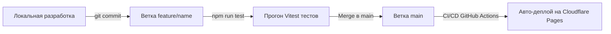

# 🚀 Легковесная дистрибуция и Роадмап поэтапной разработки Foodality

Так как наше PWA-приложение работает по архитектуре **Local-First** (всё исполняется в браузере пользователя через IndexedDB), для дистрибуции **НЕ требуется тяжелый сервер или Docker-контейнер**!

---

## ⚡ 1. Самый легковесный вариант развертывания (0$ / 0 MB RAM)

### Вариант А: Cloudflare Pages / GitHub Pages / Vercel (100% бесплатно и автоматически)
Поскольку приложение представляет собой статический PWA-пакет (папка `dist/`), его можно бесплатно выложить на глобальный CDN:

1. **Cloudflare Pages / GitHub Pages**:
   - Настраивается за 1 минуту: подключаете GitHub-репозиторий.
   - При каждом `git push` Cloudflare автоматически запускает тесты (`npm run test`), собирает проект (`npm run build`) и публикует по вашему HTTPS-домену `https://foodality.pages.dev`.
   - **Нагрузка на Raspberry Pi**: 0 МБ оперативной памяти!
   - **Стоимость**: 0 рублей навсегда.

### Вариант Б: Легковесный веб-сервер на Raspberry Pi (Caddy / Nginx)
Если вы хотите хранить статику именно на Малинке без Docker:
1. Установите бинарник **Caddy** (занимает ~15 МБ RAM вместо 200 МБ у Docker):
   ```bash
   sudo apt install caddy
   ```
2. Скопируйте папку `dist/` в `/var/www/foodality`.
3. В Caddyfile напишите 3 строчки:
   ```caddyfile
   foodality.yourdomain.com {
       root * /var/www/foodality
       file_server
       try_files {path} /index.html
   }
   ```
   Caddy сам выпустит HTTPS-сертификат и поднимет мгновенный сервер.

---

## 🛠️ 2. Правильный процесс разработки при поэтапном дописывании фич

Если вы планируете несколько последующих шагов расширения приложения, соблюдайте следующую структуру:



### Рекомендуемая структура веток в Git:
- **`main` / `master`**: Стабильная рабочая версия PWA (то, что установлено на телефоне).
- **`feature/quantization-settings`**: Ветка для разработки Этапа 2 (настраиваемое квантование пачек).
- **`feature/local-llm-fallback`**: Ветка для интеграции с Ollama на Малинке.
- **`feature/barcode-scanner`**: Ветка для сканера штрихкодов.

### Регламент перехода между этапами:
1. Разрабатываете фичу в локальной ветке `feature/имя_фичи`.
2. Проверяете тесты: `npm run test` (должно быть 100% PASS).
3. Проверяете сборку: `npm run build`.
4. Сливаетесь в `main`. CI/CD автоматом обновляет приложение на вашем телефоне!
